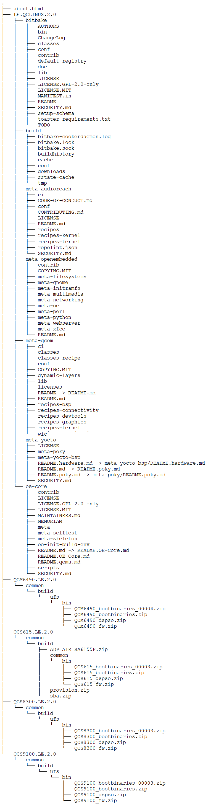
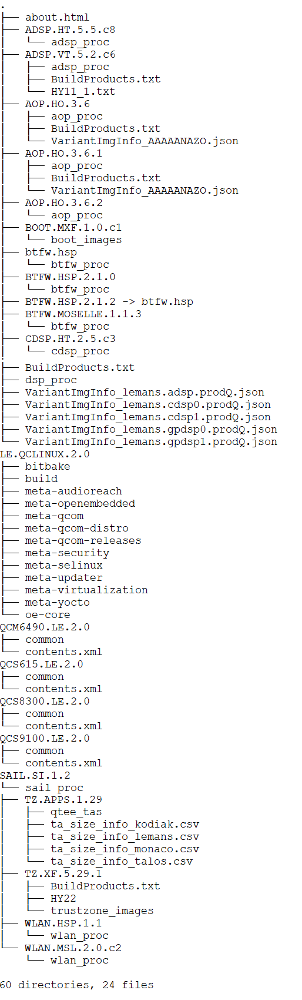

.. _howto_sync:

Sync
---------------

.. _alternative_methods_install_repo:

Alternative methods to install Repo
^^^^^^^^^^^^^^^^^^^^^^^^^^^^^^^^^^^^^^^

- The latest Repo works with python3. If your default Python is python2, then install ``python-is-python3`` to make python3 as the default Python.

   .. container:: nohighlight
      
      ::

         mkdir -p ~/bin
         cd ~/bin
         # If you already have a previous directory of repo_tool, you can delete it
         rm -rf ~/bin/repo_tool
         git clone https://android.googlesource.com/tools/repo.git -b v2.41 repo_tool
         cd repo_tool
         git checkout -b v2.41
         export PATH=~/bin/repo_tool:$PATH

- If the earlier steps didn't work, install Repo using the following commands:

   .. container:: nohighlight
      
      ::

         # Install curl (if it isn't installed)
         sudo apt install curl bc
      
         # Latest Repo version works with python3
      
         mkdir -p ~/bin
         curl https://raw.githubusercontent.com/GerritCodeReview/git-repo/v2.41/repo -o ~/bin/repo && chmod +x ~/bin/repo
         export PATH=~/bin:$PATH

How does QSC CLI work?
^^^^^^^^^^^^^^^^^^^^^^^^^^^^

1. **Setup**

   QSC CLI installs Docker and configures git.

2. **Sync**

   QSC CLI downloads the firmware sources and the Qualcomm Yocto layers, based on the input parameters.

3. **Build**

   QSC CLI builds the necessary Qualcomm firmware and the Qualcomm Yocto layers.

4. Internally, QSC CLI implements the standalone commands covered in the :doc:`Build from Source (with firmware and extras) <build_addn_info>` and leverages the prebuilt Docker images for the respective Qualcomm style software images. For example, ``LE.QCLINUX.2.0``.

View information about QSC CLI commands
^^^^^^^^^^^^^^^^^^^^^^^^^^^^^^^^^^^^^^^^^^^

To see all the commands provided by QSC CLI, run the following commands:

.. container:: nohighlight
      
   ::

      qsc-cli -h
      qsc-cli chip-software download –h

To see more details about a particular command, you can append ``-h`` to the command. For example:

.. container:: nohighlight
      
   ::

      qsc-cli chip-software compile -h

Manage workspaces using QSC CLI
^^^^^^^^^^^^^^^^^^^^^^^^^^^^^^^^^^

List the workspaces using the following command:

.. container:: nohighlight
      
   ::

      qsc-cli chip-software list-workspace

To delete a workspace, run the following command:

.. container:: nohighlight
      
   ::

      qsc-cli chip-software delete-workspace --workspace-path <workspace_path>

      # Example, qsc-cli chip-software delete-workspace --workspace-path '/local/mnt/workspace/Qworkspace'

Find a Yocto workspace using QSC CLI
^^^^^^^^^^^^^^^^^^^^^^^^^^^^^^^^^^^^^^^^

You can install the ``tree`` command and run it on your workspace. The Yocto workspace is under the ``LE.QCLINUX.2.0`` directory. These directories stay the same for future releases.

-  QSC CLI workspace structure after ``Qualcomm_Linux.SPF.2.0|TEST|DEVICE|PUBLIC`` distribution
   build

   The following is a sample view, in which:

   -  ``LE.QCLINUX.2.0`` has the Yocto workspace.
      |YoctoLEQCLinux|

-  QSC CLI workspace structure after
   ``Qualcomm_Linux.SPF.2.0|AP|Standard|OEM|NoModem`` distribution build
   with firmware and extras

   The following is a sample view, in which:

   -  ``LE.QCLINUX.2.0`` has the Yocto workspace.
   -  Few additional directories are for the Qualcomm firmware. While
      building with extras:

      -  The additional firmware is built.
      -  The output binaries from these are taken from the firmware
         recipes in the Qualcomm Yocto layers.
      -  For detailed sync and build instructions, see :doc:`Build from source (with firmware and extras) <build_addn_info>`.
      
         |ws_qsc_cli_4|

