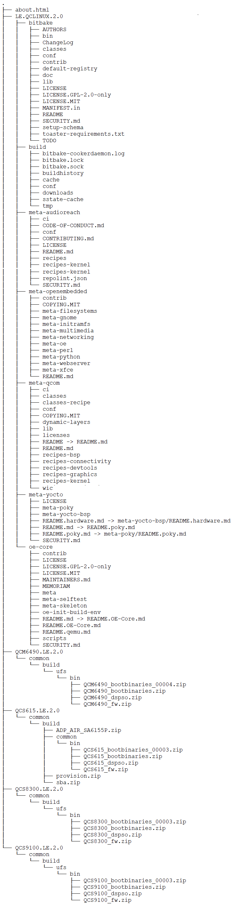
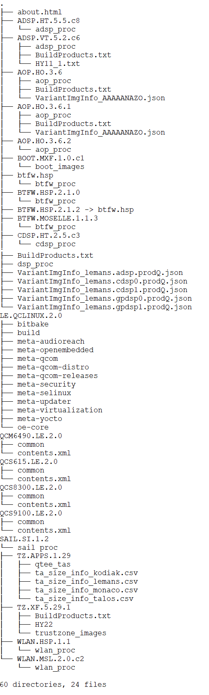

.. _howto_sync:

Sync
---------------

Setting up shared sstate and downloads cache
^^^^^^^^^^^^^^^^^^^^^^^^^^^^^^^^^^^^^^^^^^^^^^

- BitBake supports the use of ``sstate-cache`` and ``downloads`` directories to reuse previously built artifacts and speed up subsequent builds.
  By default, these directories are created inside the build directory. However, you can also configure a shared sstate-cache and downloads
  directory to reuse the same cache across multiple workspaces. 

   .. container:: nohighlight
      
      ::

          # export these variables before running the build
          export DL_DIR="/path/to/shared/downloads"
          export SSTATE_DIR="/path/to/shared/sstate"

          kas build meta-qcom/ci/<machine.yml>:meta-qcom/ci/<distro.yml>:meta-qcom/ci/linux-qcom-6.18.yml:meta-qcom/ci/lock.yml

          # Example, kas build meta-qcom/ci/iq-9075-evk.yml:meta-qcom/ci/qcom-distro-prop-image.yml:meta-qcom/ci/linux-qcom-6.18.yml:meta-qcom/ci/lock.yml

.. _alternative_methods_install_repo:

Alternative methods to install Repo
^^^^^^^^^^^^^^^^^^^^^^^^^^^^^^^^^^^^^^^

- The latest Repo works with python3. If your default Python is python2, then install ``python-is-python3`` to make python3 as the default Python.

   .. container:: nohighlight
      
      ::

         mkdir -p ~/bin
         cd ~/bin
         # If you already have a previous directory of repo_tool, you can delete it
         rm -rf ~/bin/repo_tool
         git clone https://android.googlesource.com/tools/repo.git -b v2.41 repo_tool
         cd repo_tool
         git checkout -b v2.41
         export PATH=~/bin/repo_tool:$PATH

- If the earlier steps didn't work, install Repo using the following commands:

   .. container:: nohighlight
      
      ::

         # Install curl (if it isn't installed)
         sudo apt install curl bc
      
         # Latest Repo version works with python3
      
         mkdir -p ~/bin
         curl https://raw.githubusercontent.com/GerritCodeReview/git-repo/v2.41/repo -o ~/bin/repo && chmod +x ~/bin/repo
         export PATH=~/bin:$PATH

Enable Downloads Mirror
^^^^^^^^^^^^^^^^^^^^^^^^^^

BitBake builds can fail when upstream sources being referred to are inaccessible. It usually
happens when the original source code being referred to has been moved, removed, or the server
is temporarily down. Add the following to your local.conf to add Qualcomm's download server as
a MIRROR to avoid such fetcher failures.

   .. container:: nohighlight
      
      ::

          MIRRORS:append = " \
          svn://.*/.*     https://artifacts.codelinaro.org/qli-ci/downloads/main/ \
          git://.*/.*     https://artifacts.codelinaro.org/qli-ci/downloads/main/ \
          gitsm://.*/.*   https://artifacts.codelinaro.org/qli-ci/downloads/main/ \
          hg://.*/.*      https://artifacts.codelinaro.org/qli-ci/downloads/main/ \
          p4://.*/.*      https://artifacts.codelinaro.org/qli-ci/downloads/main/ \
          https?://.*/.*  https://artifacts.codelinaro.org/qli-ci/downloads/main/ \
          ftp://.*/.*     https://artifacts.codelinaro.org/qli-ci/downloads/main/ \
          npm://.*/?.*    https://artifacts.codelinaro.org/qli-ci/downloads/main/ \
          s3://.*/.*      https://artifacts.codelinaro.org/qli-ci/downloads/main/ \
          crate://.*/.*   https://artifacts.codelinaro.org/qli-ci/downloads/main/ \
          gs://.*/.*      https://artifacts.codelinaro.org/qli-ci/downloads/main/ \
          "

One way to add this to your BitBake configuration is to create a new kas configuration file
and include this file during build:

   .. container:: nohighlight
      
      ::

          cat << EOF > meta-qcom/ci/downloads-mirrors.yml
          header:
           version: 14

          local_conf_header:
           downloads-mirror: |
            MIRRORS:append = " \
            svn://.*/.*     https://artifacts.codelinaro.org/qli-ci/downloads/main/ \\
            git://.*/.*     https://artifacts.codelinaro.org/qli-ci/downloads/main/ \\
            gitsm://.*/.*   https://artifacts.codelinaro.org/qli-ci/downloads/main/ \\
            hg://.*/.*      https://artifacts.codelinaro.org/qli-ci/downloads/main/ \\
            p4://.*/.*      https://artifacts.codelinaro.org/qli-ci/downloads/main/ \\
            https?://.*/.*  https://artifacts.codelinaro.org/qli-ci/downloads/main/ \\
            ftp://.*/.*     https://artifacts.codelinaro.org/qli-ci/downloads/main/ \\
            npm://.*/?.*    https://artifacts.codelinaro.org/qli-ci/downloads/main/ \\
            s3://.*/.*      https://artifacts.codelinaro.org/qli-ci/downloads/main/ \\
            crate://.*/.*   https://artifacts.codelinaro.org/qli-ci/downloads/main/ \\
            gs://.*/.*      https://artifacts.codelinaro.org/qli-ci/downloads/main/ \\
            "
          EOF

          kas build <kas configuration files>:meta-qcom/ci/downloads-mirror.yml
          # Example, kas build meta-qcom/ci/iq-9075-evk.yml:meta-qcom/ci/qcom-distro-prop-image.yml:meta-qcom/ci/linux-qcom-6.18.yml:meta-qcom/ci/lock.yml:meta-qcom/ci/downloads-mirrors.yml

How does QSC CLI work?
^^^^^^^^^^^^^^^^^^^^^^^^^^^^

1. **Setup**

   QSC CLI installs Docker and configures git.

2. **Sync**

   QSC CLI downloads the firmware sources and the Qualcomm Yocto layers, based on the input parameters.

3. **Build**

   QSC CLI builds the necessary Qualcomm firmware and the Qualcomm Yocto layers.

4. Internally, QSC CLI implements the standalone commands covered in the :doc:`Build from Source (with firmware and devtool) <build_addn_info>` and leverages the prebuilt Docker images for the respective Qualcomm style software images. For example, ``LE.QCLINUX.2.0``.

View information about QSC CLI commands
^^^^^^^^^^^^^^^^^^^^^^^^^^^^^^^^^^^^^^^^^^^

To see all the commands provided by QSC CLI, run the following commands:

.. container:: nohighlight
      
   ::

      qsc-cli -h
      qsc-cli chip-software download –h

To see more details about a particular command, you can append ``-h`` to the command. For example:

.. container:: nohighlight
      
   ::

      qsc-cli chip-software compile -h

Manage workspaces using QSC CLI
^^^^^^^^^^^^^^^^^^^^^^^^^^^^^^^^^^

List the workspaces using the following command:

.. container:: nohighlight
      
   ::

      qsc-cli chip-software list-workspace

To delete a workspace, run the following command:

.. container:: nohighlight
      
   ::

      qsc-cli chip-software delete-workspace --workspace-path <workspace_path>

      # Example, qsc-cli chip-software delete-workspace --workspace-path '/local/mnt/workspace/Qworkspace'

Find a Yocto workspace using QSC CLI
^^^^^^^^^^^^^^^^^^^^^^^^^^^^^^^^^^^^^^^^

You can install the ``tree`` command and run it on your workspace. The Yocto workspace is under the ``LE.QCLINUX.2.0`` directory. These directories stay the same for future releases.

-  QSC CLI workspace structure after ``Qualcomm_Linux.SPF.2.0|TEST|DEVICE|PUBLIC`` distribution
   build

   The following is a sample view, in which:

   -  ``LE.QCLINUX.2.0`` has the Yocto workspace.
      |YoctoLEQCLinux|

-  QSC CLI workspace structure after
   ``Qualcomm_Linux.SPF.2.0|AP|Standard|OEM|NoModem`` distribution build
   with firmware and devtool

   The following is a sample view, in which:

   -  ``LE.QCLINUX.2.0`` has the Yocto workspace.
   -  Few additional directories are for the Qualcomm firmware. While
      building with extras:

      -  The additional firmware is built.
      -  The output binaries from these are taken from the firmware
         recipes in the Qualcomm Yocto layers.
      -  For detailed sync and build instructions, see :doc:`Build from source (with firmware and devtool) <build_addn_info>`.
      
         |ws_qsc_cli_4|

